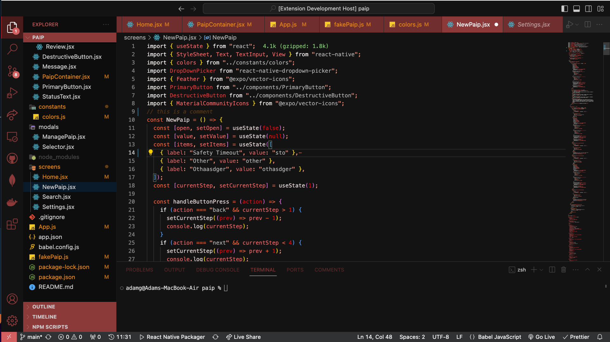

# Lava Lake Red - VS Code Theme

Immerse yourself in the fiery world of coding with Lava Lake Red, a Visual Studio Code theme that takes you on an intense journey inspired by the erupting volcanoes and molten lava lakes. Designed for developers who are drawn to the power and vibrancy of a volcanic landscape.

🌋 Features

- **Vibrant Red Tones**: Experience a spectrum of red shades, from the bright glow of flowing lava to the deep, smoldering reds of a volcanic crater.
- **Volcanic Aesthetics**: Elements inspired by the dramatic volcanic environment, including sharp contrasts and dynamic highlights that emulate the energy of a lava flow.
- **High Contrast**: Bold and striking color choices to enhance focus and increase the legibility of your code.
- **Syntax Highlighting**: Advanced highlighting for clear distinction in syntax, making code easier to write, read, and understand.
- **Wide Language Support**: Fully compatible with a diverse range of programming languages and file types in VS Code.

📸 Screenshot

_Take a look at Lava Lake Red in action!_

🛠 Installation

1. Open Extensions sidebar panel in VS Code. `View → Extensions`
2. Search for `Lava Lake Red`
3. Click `Install`
4. Click `Reload` to reload your editor
5. `Code/File → Preferences → Color Theme → Lava Lake Red`

📝 Feedback
Your feedback and suggestions are crucial! If you have any ideas or encounter any issues, please feel free to open an issue in the [GitHub repository](https://github.com/AKCodeWorks/lava-lake-red).

📘 License
This theme is open source and available under the MIT License.

_Embrace the fiery essence of coding with Lava Lake Red!_
